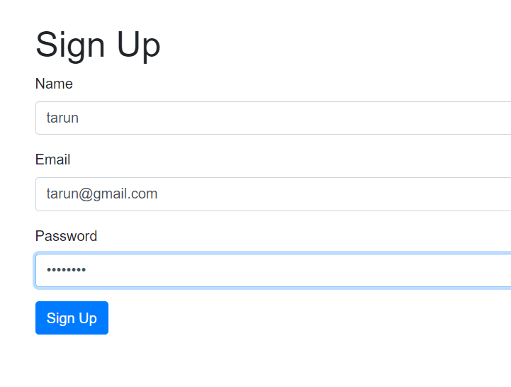
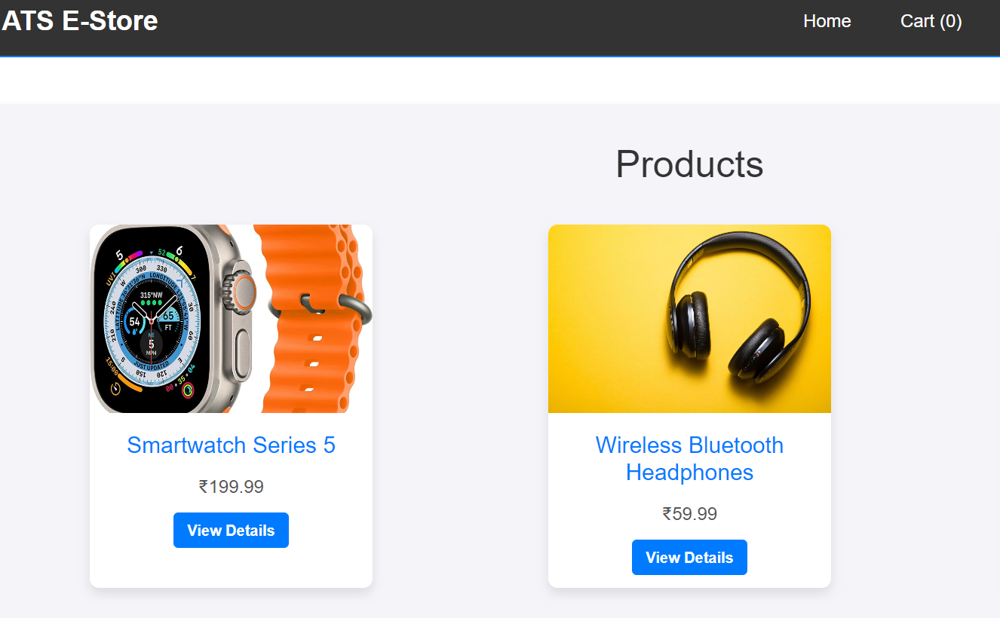
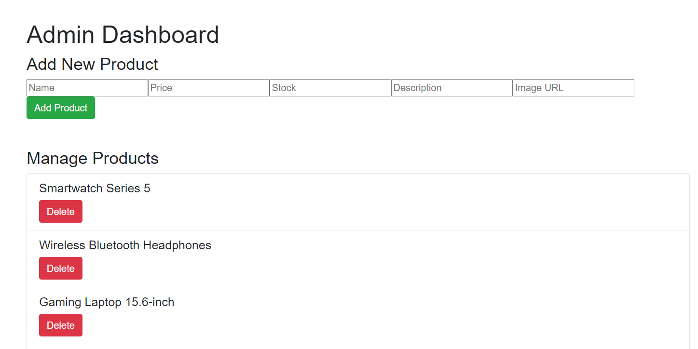
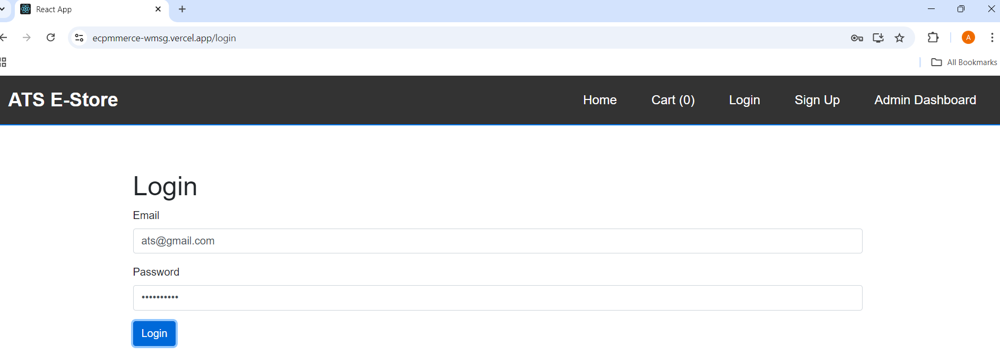

# 🛍️ E-Commerce Store

Welcome to the **E-Commerce Store** project! This web application allows users to explore a wide range of products, manage their shopping carts, and enjoy a seamless shopping experience. Built with React and Node.js, it's perfect for learning how to create modern web applications.


## 🌐 **Live Demo**
Check out the live version of the chatbot here:  
[**Hosted Website**](https://ecpmmerce-wmsg.vercel.app/)

## 📦 Features

- **Product Listing**: Browse through a variety of products with images, names, and prices.
- **Product Details**: Click on any product to view detailed information.
- **Shopping Cart**: Easily add items to your cart and manage your selections.
- **User Authentication**: Sign up and log in to access personalized features.
- **Admin Dashboard**: Admins can add or delete products from the inventory.

## 🛠️ Technologies Used

- **Frontend**: React, React Router, Axios
- **Backend**: Node.js, Express, MongoDB
- **Styling**: Inline CSS and Bootstrap

## 🚀 Getting Started

### Prerequisites

- Node.js installed on your machine
- MongoDB set up and running

### Installation

1. Clone the repository:
   ```bash
   git clone https://github.com/AdityaTarunofficial/ecommerce-store.git
   ```
2. Navigate to the frontend and backend folders:
   ```bash
   cd ecommerce-store/frontend
   npm install
   ```
   ```bash
   cd ../backend
   npm install
   ```
3. Start the backend server:
   ```bash
   npm start
   ```
4. Start the frontend development server:
   ```bash
   cd ../frontend
   npm start
   ```

### Usage

- Open your browser and go to `http://localhost:3000` to explore the store!

## 💡 How to Contribute

1. Fork the repository.
2. Create a new branch:
   ```bash
   git checkout -b feature/YourFeature
   ```
3. Make your changes and commit them:
   ```bash
   git commit -m "Add some feature"
   ```
4. Push to the branch:
   ```bash
   git push origin feature/YourFeature
   ```
5. Create a pull request.


## Screenshots

### Sign Up Page


### Product Listings Page


### Admin Dashboard Page


### Login Page



